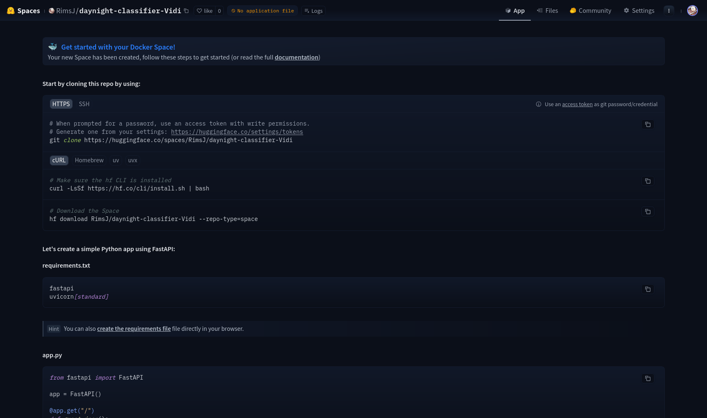

# 🚿 Praktikum 2 - Deployment Model ML ke Hugging Face

## Deskripsi

Pada praktikum ini, mahasiswa akan melakukan siklus lengkap pengembangan Machine Learning (MLOps sederhana). Setelah melatih model klasifikasi gambar (Day vs Night) menggunakan ekstraksi fitur HOG dan Neural Network, mahasiswa akan melakukan deployment ke server cloud Hugging Face menggunakan Docker container.

## Tujuan

Setelah menyelesaikan praktikum ini, mahasiswa diharapkan mampu:

1. Membuat aplikasi web server menggunakan Flask
2. Mengkonfigurasi Docker container untuk lingkungan ML
3. Melakukan deployment aplikasi ke Hugging Face Spaces menggunakan Git CLI

---

## Langkah 1: Persiapan Environment

Langkah pertama adalah menyiapkan struktur direktori kerja dan memastikan file model tersedia.

1. Buat folder baru di komputer Anda dengan nama `daynight-project`
2. Cari file model (`day_night_model.h5`) dan scaler (`scaler.pkl`) hasil training dari praktikum sebelumnya
3. Pindahkan kedua file tersebut ke dalam folder `daynight-project`
4. Buka terminal (Git Bash atau CMD), lalu arahkan direktori ke folder tersebut

---

## Langkah 2: Konfigurasi Server (`app.py`)

Diperlukan aplikasi web sederhana menggunakan Flask untuk menangani request gambar dari pengguna.

1. Buat file baru bernama `app.py` di dalam folder proyek
2. Salin kode berikut ke dalamnya (kode ini memuat model dan melakukan preprocessing HOG yang sama persis dengan saat training):

```python
import os
import numpy as np
import cv2
import pickle
import tensorflow as tf
from flask import Flask, request, render_template_string
from skimage.feature import hog

app = Flask(__name__)

# Load Model & Scaler
MODEL_PATH = 'day_night_model.h5'
SCALER_PATH = 'scaler.pkl'

try:
    model = tf.keras.models.load_model(MODEL_PATH)
    with open(SCALER_PATH, 'rb') as f:
        scaler = pickle.load(f)
    print("✅ System Loaded Successfully")
except Exception as e:
    print(f"❌ Error loading system: {e}")

def preprocess_image(image_bytes):
    # Decode gambar
    nparr = np.frombuffer(image_bytes, np.uint8)
    img = cv2.imdecode(nparr, cv2.IMREAD_COLOR)

    # Preprocessing (Harus sama persis dengan Training)
    img = cv2.resize(img, (256, 256))
    gray = cv2.cvtColor(img, cv2.COLOR_BGR2GRAY)

    hog_feat = hog(gray, orientations=9, pixels_per_cell=(8,8),
                   cells_per_block=(2,2), block_norm='L2-Hys',
                   visualize=False, feature_vector=True)

    return scaler.transform(hog_feat.reshape(1, -1))

@app.route('/', methods=['GET'])
def home():
    return render_template_string('''
    <div style="text-align:center; padding:50px;">
        <h1>Day vs Night Classifier</h1>
        <form action="/predict" method="post" enctype="multipart/form-data">
            <input type="file" name="file" required><br><br>
            <button type="submit">Prediksi</button>
        </form>
    </div>
    ''')

@app.route('/predict', methods=['POST'])
def predict():
    try:
        file = request.files['file']
        data = preprocess_image(file.read())
        prediction = model.predict(data)[0][0]

        label = "Day (Siang)" if prediction > 0.5 else "Night (Malam)"
        return f"<h2 style='text-align:center'>Hasil: {label}</h2><center><a href='/'>Kembali</a></center>"
    except Exception as e:
        return f"Error: {e}"

if __name__ == '__main__':
    # Port 7860 wajib untuk Hugging Face Spaces
    app.run(host='0.0.0.0', port=7860)
```

---

## Langkah 3: Konfigurasi Dependencies (`requirements.txt`)

Agar server cloud tahu library apa saja yang dibutuhkan, perlu membuat daftar dependencies.

1. Buat file baru bernama `requirements.txt`
2. Isi file tersebut dengan daftar library berikut:

```txt
flask
tensorflow-cpu
numpy
scikit-learn
scikit-image
opencv-python-headless
gunicorn
```

---

## Langkah 4: Konfigurasi Docker (`Dockerfile`)

Dockerfile berisi instruksi untuk membangun image sistem operasi yang akan menjalankan aplikasi kita.

1. Buat file bernama `Dockerfile` (tanpa ekstensi file apapun)
2. Salin konfigurasi berikut:

```dockerfile
# Base Image Python 3.9 Slim
FROM python:3.9-slim

# Install Library Sistem untuk OpenCV (Debian Bookworm/Trixie Compatible)
RUN apt-get update && apt-get install -y \
    libgl1 \
    libglib2.0-0 \
    && rm -rf /var/lib/apt/lists/*

# Setup User Non-Root (Standar Keamanan HF)
RUN useradd -m -u 1000 user
USER user
ENV PATH="/home/user/.local/bin:$PATH"

# Setup Direktori Kerja
WORKDIR /app

# Install Dependencies
COPY --chown=user ./requirements.txt requirements.txt
RUN pip install --no-cache-dir --upgrade -r requirements.txt

# Copy File Aplikasi
COPY --chown=user . /app

# Expose Port & Jalankan
EXPOSE 7860
CMD ["python", "app.py"]
```

---

## Langkah 5: Setup Hugging Face Space

Sekarang perlu membuat wadah untuk aplikasi ini di Hugging Face.

1. Login ke akun [Hugging Face](https://huggingface.co/)
2. Klik foto profil di pojok kanan atas, lalu pilih **New Space**
3. Isi konfigurasi berikut:
   - **Space Name**: `daynight-classifier-namaanda` (ganti `namaanda` dengan nama/NIM anda)
   - **License**: Apache 2.0 / MIT
   - **Space SDK**: Pilih **Docker**
   - **Template**: kosongi
   - **Visibility**: Public
4. Klik tombol **Create Space**
5. Buat Access Token untuk izin upload:
   - Masuk ke **Settings > Access Tokens**
   - Klik **Create new token**
   - Pilih permission **Write**
   - Salin token tersebut (simpan di notepad sementara)

---

## Langkah 6: Upload ke Cloud (Hugging Face)

Pada langkah ini, akan dilakukan dengan cara men-download repository kosong dari Hugging Face ke komputer, mengisi file-nya, lalu mengunggahnya kembali.

### 1. Clone Repository

Buka terminal (Git Bash) di direktori tempat Anda ingin menyimpan proyek, lalu jalankan perintah berikut untuk mengambil repository dari Hugging Face:

```bash
# Ganti USERNAME_ANDA dan NAMA_SPACE dengan milik Anda
git clone https://huggingface.co/spaces/USERNAME_ANDA/NAMA_SPACE
```

**Contoh format yang benar:**

```bash
git clone https://huggingface.co/spaces/VAHFirdaus/daynight-classifier
```

### 2. Pindahkan File ke Folder Repository

Setelah perintah di atas selesai, akan muncul folder baru di perangkat anda dengan nama Space Anda.

- Buka File Explorer
- Salin/Pindahkan semua file yang sudah Anda siapkan sebelumnya (`app.py`, `Dockerfile`, `requirements.txt`, `day_night_model.h5`, dan `scaler.pkl`) ke dalam folder baru hasil clone tersebut

### 3. Upload File ke Hugging Face

Kembali ke terminal, masuk ke dalam folder yang baru saja di-clone, lalu lakukan proses upload:

```bash
# 1. Masuk ke folder repository (sesuaikan nama foldernya)
cd daynight-classifier

# 2. Tambahkan semua file
git add .

# 3. Simpan perubahan
git commit -m "Deploy aplikasi ke HF"

# 4. Upload ke server
git push
```

### 4. Autentikasi (Password = Token)

Saat perintah `git push` dijalankan, terminal akan meminta kredensial:

- **Username**: Masukkan username Hugging Face Anda (misal: `VAHFirdaus`)
- **Password**: JANGAN masukkan password login akun, namun Copy dan Paste **Access Token** yang sudah Anda buat di Langkah 5 dan telah anda simpan di notepad tadi

---

## Langkah 7: Pengujian dan Hasil Akhir

Setelah proses `git push` selesai 100%:

1. Kembali ke browser, buka halaman Space Anda
2. Klik tab **App**
3. Perhatikan status di bagian atas:
   - Akan berubah menjadi **Building** (Warna Biru)
   - Tunggu 3-5 menit hingga menjadi **Running** (Warna Hijau)
4. Jika sudah **Running**, upload gambar tes (siang/malam) dan pastikan prediksi berjalan lancar

### Screenshot Hasil Deployment

**Tampilan Awal Huggingface:**



**Tampilan Awal Space:**


**Hasil Prediksi Night (Malam):**


**Gambar Yang digunakan untuk test:**


---

## Struktur Folder Akhir

```
daynight-project/
├── app.py
├── Dockerfile
├── requirements.txt
├── day_night_model.h5
└── scaler.pkl
```

---

## Troubleshooting

### Error saat git push

- Pastikan username dan token benar
- Token harus memiliki permission **Write**

### Docker Build Failed

- Periksa format Dockerfile (tidak ada ekstensi file)
- Pastikan semua file ada di folder yang sama

### Model tidak bisa di-load

- Pastikan path model benar di `app.py`
- Pastikan file `day_night_model.h5` dan `scaler.pkl` ada

---

## Referensi

- [Modul Praktikum Pembelajaran Mesin 2025/2026](https://polinema.gitbook.io/jti-modul-praktikum-pembelajaran-mesin-2025-2026/js15-pipeline-machine-learning-and-deployment/praktikum-2)
- [Hugging Face Spaces Documentation](https://huggingface.co/docs/hub/spaces)
- [Flask Documentation](https://flask.palletsprojects.com/)
- [Docker Documentation](https://docs.docker.com/)
